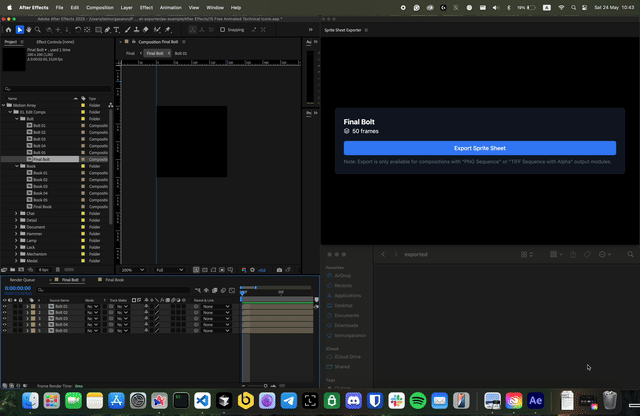

# Sprite Sheet Exporter

A powerful Adobe After Effects extension for exporting sprite sheets from compositions. This extension was bootstrapped with [bolt-cep](https://github.com/hyperbrew/bolt-cep/).

## Features

- Export composition frames as a sprite sheet
- Automatic frame arrangement in a grid layout
- Support for PNG and TIFF sequences with alpha channel
- Real-time composition information display
- Export both sprite sheet image and metadata JSON
- Clean temporary files management

## How It Works

### After Effects Integration (`src/jsx/aeft`)

The extension integrates with After Effects through two main functions:

1. `getCompositionInfo`: 
   - Retrieves active composition details
   - Returns composition name, dimensions, frame rate, duration, and total frames
   - Used for real-time composition monitoring

2. `exportFrames`:
   - Exports composition frames as a sequence
   - Supports "PNG Sequence" and "TIFF Sequence with Alpha" output modules
   - Manages render queue and output settings
   - Returns success status and export format

### Sprite Sheet Generation (`src/js/features/sprite-sheet`)

The sprite sheet feature processes the exported frames:

1. `exportSpriteSheet`:
   - Creates temporary directory for frame export
   - Manages the export process from After Effects
   - Generates sprite sheet and metadata
   - Prompts for save locations
   - Cleans up temporary files

2. `createSpriteSheet`:
   - Calculates optimal grid layout
   - Imports and processes individual frames
   - Generates sprite sheet metadata (frame positions, dimensions)
   - Supports both PNG and TIFF formats

### User Interface (`src/js/main`)

The main interface provides:

- Real-time composition information display
- Export button with loading state
- Success/failure notifications
- File path information for exported assets
- Format compatibility warnings

## Usage

1. Open your composition in After Effects
2. Ensure your composition uses either "PNG Sequence" or "TIFF Sequence with Alpha" output module
3. Click "Export Sprite Sheet"
4. Choose save location for the sprite sheet
5. Get both the sprite sheet image and metadata JSON

## Output Format

### Sprite Sheet Image
- Format: PNG
- Layout: Grid-based arrangement
- Dimensions: Automatically calculated based on frame count

### Metadata JSON
```json
{
  "frameWidth": number,
  "frameHeight": number,
  "frames": [
    {
      "x": number,
      "y": number,
      "width": number,
      "height": number
    }
  ],
  "totalFrames": number,
  "frameRate": number
}
```

## Demo

### GIF


### MP4
[▶️ Watch demo MP4](./demo.mp4)

## Requirements

- Adobe After Effects
- Compatible output module setup ("PNG Sequence" or "TIFF Sequence with Alpha")

## Example Project

The repository includes an example After Effects project in the `ae-example` directory that you can use to test the extension:

### Project Structure
- `After Effects/` 
  - Contains "15 Free Animated Technical Icons.aep" - a sample project with animated icons
  - Includes source Illustrator files in CS6 format
- `Font/` - Required fonts for the project
- `Help/` - Documentation including detailed User Guide
- `After Effects Instructions.pdf` - Step-by-step setup guide

This example project is perfect for testing the sprite sheet export functionality as it contains multiple animated icons that can be exported as individual sprite sheets.

> Note: The example project is configured for macOS ARM64 (Apple Silicon) systems.

## Development

This project uses:
- React for UI
- TypeScript for type safety
- Adobe CEP integration via bolt-cep
- Canvas for sprite sheet generation 